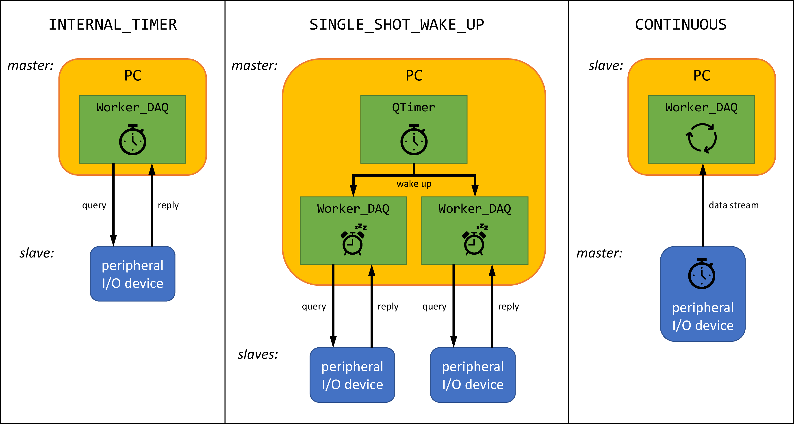

.. py:module:: dvg_qdeviceio
.. _`CONTINUOUS`:

DAQ_TRIGGER.CONTINUOUS
----------------------------------

    Typical use-cases for the different :class:`DAQ_TRIGGER` modes of
    :class:`Worker_DAQ`. Variations are possible.

...
Potentially the fastest DAQ rate when the device side is sending chunks of
binary data to the host PC. Harder to set up. Should involve buffered data
transmission on the device and PC side when high DAQ-rates are needed
> 10kHz. Point to my Arduino lock-in amplifier on GitHub.
...

TODO: Extend section