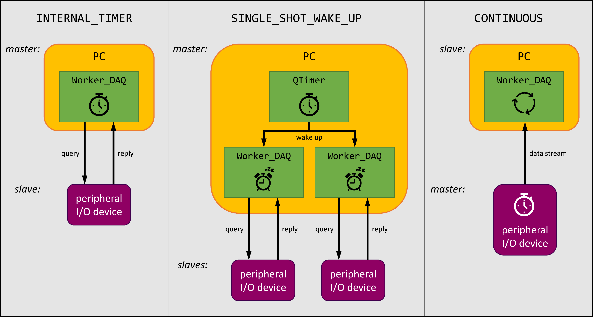

.. py:module:: DvG_QDeviceIO
.. _`SINGLE_SHOT_WAKE_UP`:

DAQ_trigger.SINGLE_SHOT_WAKE_UP
----------------------------------

    Typical use-cases for the different :class:`DAQ_trigger` modes of
    :class:`Worker_DAQ`. Variations are possible.

The :class:`Worker_DAQ` class instance will update once only, whenever
it has received a so-called *wake-up* call. A wake-up can be requested
by calling method :meth:`QDeviceIO.wake_up_DAQ`. There are two distinct
ways in which this mode can be used.

**Periodical**:

The one outlined in the above diagram shows a
stand-alone :class:`PyQt5.QtCore.QTimer` that periodically and
simultaneously wakes up two different instances of :class:`Worker_DAQ`,
each communicating with a different peripheral I/O device. It is an easy
way to sync the data acquisition between different devices, where the PC
acts as a master.

Example::

    from DvG_QDeviceIO import QDeviceIO, DAQ_trigger
    from PyQt5 import QtCore

    app = QtCore.QCoreApplication()

    qdev_1 = QDeviceIO(my_device_1)
    qdev_1.create_worker_DAQ(
        DAQ_trigger  = DAQ_trigger.SINGLE_SHOT_WAKE_UP,
        DAQ_function = my_DAQ_function_1,
    )

    qdev_2 = QDeviceIO(my_device_2)
    qdev_2.create_worker_DAQ(
        DAQ_trigger  = DAQ_trigger.SINGLE_SHOT_WAKE_UP,
        DAQ_function = my_DAQ_function_2,
    )

    # We create the sync timer in the main thread in this example, but it is better
    # for the timing stability to transfer the sync timer to a separate thread.
    timer = QtCore.QTimer()
    timer.setInterval(10)                       # 10 ms --> 100 Hz
    timer.setTimerType(QtCore.Qt.PreciseTimer)  # ~1 ms granularity, resource heavy
    timer.timeout.connect(qdev_1.wake_up_DAQ)
    timer.timeout.connect(qdev_2.wake_up_DAQ)

    qdev_1.start()
    qdev_2.start()
    timer.start()

    while True:
        app.processEvents()  # Needed to have the sync timer tick

Alternative example (undocumented)::

    from DvG_QDeviceIO import QDeviceIO, DAQ_trigger

    qdev_1 = QDeviceIO(my_device_1)
    qdev_1.create_worker_DAQ(
        DAQ_trigger     = DAQ_trigger.INTERNAL_TIMER,
        DAQ_function    = my_DAQ_function_1,
        DAQ_interval_ms = 10,  # 10 ms --> 100 Hz
    )

    qdev_2 = QDeviceIO(my_device_2)
    qdev_2.create_worker_DAQ(
        DAQ_trigger  = DAQ_trigger.SINGLE_SHOT_WAKE_UP,
        DAQ_function = my_DAQ_function_2,
    )

    qdev_1.worker_DAQ._timer.timeout.connect(qdev_2.wake_up_DAQ)
    qdev_2.start()  # First make sure SINGLE_SHOT_WAKE_UP is up and running
    qdev_1.start()  # and only then start INTERNAL_TIMER

**Aperiodical**:

... button press by the user
... a process variable that crossed a threshold

